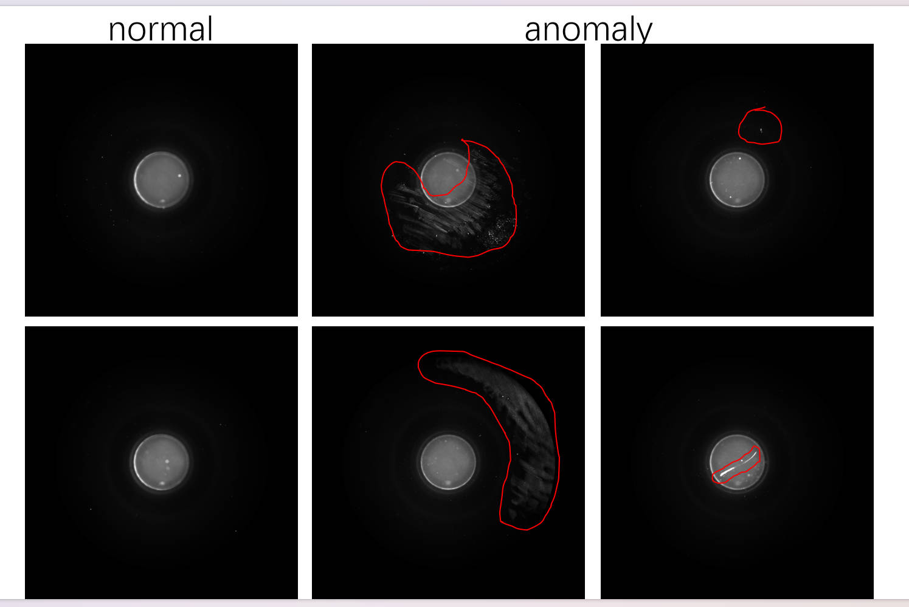
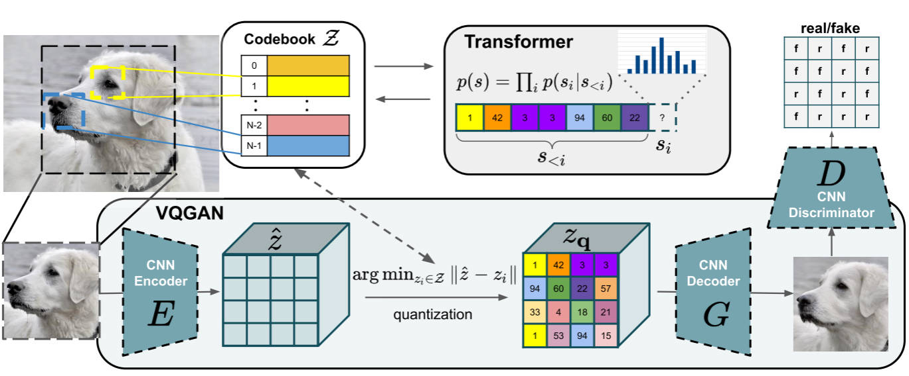
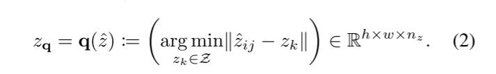
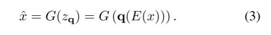
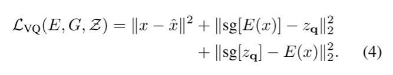

 异常图片生成

 

### **现有问题**  

1. **真实异常样本稀缺**：工业场景中产品缺陷罕见，导致训练数据严重不平衡（大量正常样本 vs 极少异常样本）。  
2. **现有异常生成方法效果有限**：
   - **模型无关方法**（如 Crop&Paste）：简单拼接异常纹理到正常图像，生成结果缺乏真实性与上下文一致性（见图1）。
   - **GAN-based 方法**（如 DRAEM）：在异常定位上表现有限，且无法支持异常分类任务；生成质量受限于 GAN 训练不稳定性和模式崩溃问题。  
3. **下游任务受限**：由于缺乏高质量异常数据，现有方法难以同时支持检测、定位和分类三大任务。

---

### **提出的方法**  

AnomalyDiffusion 是一个**条件扩散模型**，其核心流程如下：

1. **输入**：一张正常图像$`I_{\text{norm}}`$ + 一张异常掩码$`M`$（指示异常位置与形状）。
2. **掩码生成模块**（基于 Textual Inversion）：
   - 利用少量真实异常掩码学习一个可泛化的“掩码嵌入”；
   - 生成大量多样化的合成掩码，提升异常形态多样性。
3. **扩散生成主干**（U-Net 架构）：
   - 引入 **空间异常嵌入（SAE）**：将掩码编码为位置感知的条件信号；
   - 采用 **掩码扩散损失（Masked Diffusion Loss）**：仅在异常区域计算重建损失；
   - 设计 **自适应注意力重加权机制（AAR）**：利用交叉注意力图与掩码对齐，增强空间一致性。$$
4. **输出**：合成异常图像$`I_{\text{anom}} = I_{\text{norm}} + \text{realistic anomaly at } M`$。

> **图示参考**：论文图1（Bottom）展示了 AnomalyDiffusion 在 hazelnut-crack 和 capsule-squeeze 类别上生成的异常图像，明显比 Crop&Paste 和 DRAEM 更真实、边界更自然。

---

### **方法如何解决问题**  

- **解决数据稀缺**：通过扩散模型强大的生成能力，从 few-shot 异常样本中学习分布，生成大量训练数据。  
- **提升生成真实性**：
  - SAE 和 AAR 确保异常出现在掩码指定位置，且与背景纹理融合自然；
  - 掩码扩散损失聚焦异常区域细节，避免全局模糊。  
- **支持多任务**：生成的图像包含明确异常类型与位置，可直接用于训练分类器（AC）、检测器（AD）和定位模型（AL）。  
- **避免 GAN 缺陷**：扩散模型训练更稳定，生成多样性更高，不易模式崩溃。

---

### **实验结果**  

1. **生成质量评估**：
   - 在 MVTec AD 数据集上，AnomalyDiffusion 在 IS（Inception Score）和 IC-LPIPS（多样性）指标上显著优于 DRAEM、Crop&Paste 等基线。
   - 人工评估显示生成异常更逼真、边界更清晰（见图1）。

2. **下游任务性能**：
   - **异常分类（AC）**：使用生成数据训练 ResNet-34，平均准确率达 **66.09%**，远超 DFMGAN（49.61%）。
   - **异常检测与定位（AD/AL）**：
     - 仅用一个简单 U-Net 在生成数据上训练，在 MVTec 上达到 **95.3% 像素级 AUROC**；
     - 性能媲美或超越当前 SOTA 无监督方法（如 PatchCore、CFLOW），证明生成数据高度可用。

3. **消融实验**：验证了 SAE、AAR 和掩码损失各自对生成质量与任务性能的贡献。

---

综上，AnomalyDiffusion 通过创新的扩散模型架构与条件机制，有效解决了工业异常数据稀缺问题，为少样本异常检测提供了高质量数据增强方案。

### MVTec 数据集

- MVTec数据集包含5354张不同目标和纹理类型的高分辨彩色图像。它包含用于训练的正常（即不包含缺陷）的图像，以及用于测试的异常图像。异常有70种不同类型的缺陷，例如划痕、凹痕、污染和不同结构变化。

- 此外，本文为异常提供了像素级精确的标签。

- 本文还对目前最先进的基于深度结构的无监督异常检测方法进行了评估，例如卷积自动编码CAE、生成对抗网络GAN、基于预训练卷积神经网络的特征描述符以及传统的计算机视觉方法。

MVTec数据集是第一个全面的、多目标、多缺陷并且提供像素级精确标签的异常检测数据集，关注于真实世界应用。

### 如何使用 Transformer 架构实现高分辨率图像合成

如何利用 Transformer 架构实现高分辨率图像合成，突破传统卷积生成模型（如 GANs）在建模长程依赖和全局结构方面的局限性。作者系统性地将自注意力机制引入图像生成任务，设计了一种基于 Transformer 的高分辨率图像生成框架。

现有问题: 传统基于 CNN 的生成模型（如 StyleGAN）虽然在图像质量上表现优异，但其局部感受野难以有效建模图像中的全局语义一致性和长距离依赖关系；而早期基于 Transformer 的图像生成方法（如 Image Transformer）受限于计算复杂度，只能在低分辨率（如 32×32 或 64×64）图像上训练，无法直接扩展到高分辨率（如 256×256 或更高）图像合成。

提出的方法: 它提出了一种分层、稀疏或基于向量量化的 Transformer 图像生成架构（具体方法名称未在提供的文本中明确，但可推断为类似 VQ-Transformer 或 Hierarchical Transformer 的设计）。其流程大致包括：  

1. 使用向量量化变分自编码器（VQ-VAE）将高分辨率图像压缩为低维离散潜在表示（token 序列）；  
2. 在离散潜在空间上训练一个自回归 Transformer 模型，以建模 token 之间的全局依赖；  
3. 通过解码器将生成的 token 序列重建为高分辨率图像。  
   （注：文中引用了 Mentzer et al. [47]、Ramesh et al. [59]、Menick & Kalchbrenner [46] 等工作，暗示采用了 VQ + Transformer 范式。）

方法如何解决问题： 该方法通过两阶段策略解决高分辨率生成难题：  

- 第一阶段（VQ-VAE）大幅降低图像空间维度，将像素级建模转化为对紧凑离散 token 序列的建模，缓解了 Transformer 的计算瓶颈；  
- 第二阶段（Transformer）在 token 序列上利用自注意力机制捕获全局上下文信息，从而确保生成图像在语义和结构上的一致性，克服了 CNN 生成器的局部性缺陷。

实验结果： 论文在多个高分辨率图像数据集（如 ImageNet、FFHQ）上验证了所提方法的有效性。实验表明，该方法能够生成细节丰富、结构合理的 256×256 甚至更高分辨率图像，在 FID（Fréchet Inception Distance）和 IS（Inception Score）等指标上优于或媲美当时的 SOTA GAN 模型（如 StyleGAN2），同时展现出更强的多样性与语义可控性。此外，消融实验验证了 Transformer 在建模长程依赖方面的优势。

