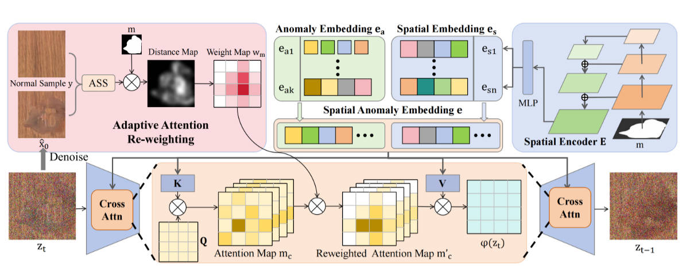

# 异常图片生成

### **提出的方法**  

AnomalyDiffusion 是一个**条件扩散模型**，其核心流程如下：

1. **输入**：一张正常图像 \( I_{\text{norm}} \) + 一张异常掩码 \( M \)（指示异常位置与形状）。
2. **掩码生成模块**（基于 Textual Inversion）：
   - 利用少量真实异常掩码学习一个可泛化的“掩码嵌入”；
   - 生成大量多样化的合成掩码，提升异常形态多样性。
3. **扩散生成主干**（U-Net 架构）：
   - 引入 **空间异常嵌入（SAE）**：将掩码编码为位置感知的条件信号；
   - 采用 **掩码扩散损失（Masked Diffusion Loss）**：仅在异常区域计算重建损失；
   - 设计 **自适应注意力重加权机制（AAR）**：利用交叉注意力图与掩码对齐，增强空间一致性。
4. **输出**：合成异常图像 \( I_{\text{anom}} = I_{\text{norm}} + \text{realistic anomaly at } M \)。

> **图示参考**：论文图1（Bottom）展示了 AnomalyDiffusion 在 hazelnut-crack 和 capsule-squeeze 类别上生成的异常图像，明显比 Crop&Paste 和 DRAEM 更真实、边界更自然。

---

### **方法如何解决问题**  

- **解决数据稀缺**：通过扩散模型强大的生成能力，从 few-shot 异常样本中学习分布，生成大量训练数据。  
- **提升生成真实性**：
  - SAE 和 AAR 确保异常出现在掩码指定位置，且与背景纹理融合自然；
  - 掩码扩散损失聚焦异常区域细节，避免全局模糊。  
- **支持多任务**：生成的图像包含明确异常类型与位置，可直接用于训练分类器（AC）、检测器（AD）和定位模型（AL）。  
- **避免 GAN 缺陷**：扩散模型训练更稳定，生成多样性更高，不易模式崩溃。
